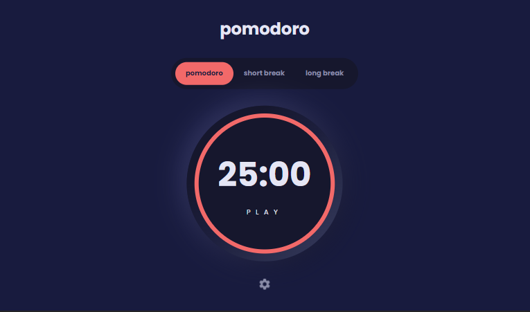

# 🍅 Pomodoro JS

 
	🚧 Finished ! 🚧

This is a pomodoro timer used to get more focus and concentration that is being developed only with HTML, CSS and Javascript and its design is inspired by the [Frontend Mentor](https://www.frontendmentor.io/challenges/pomodoro-app-KBFnycJ6G) challenge. You can test the project at this link : [Click Here!]()

## 👩🏻 Autor

Made with 💜 by Evelyn Monteiro 👋
 

